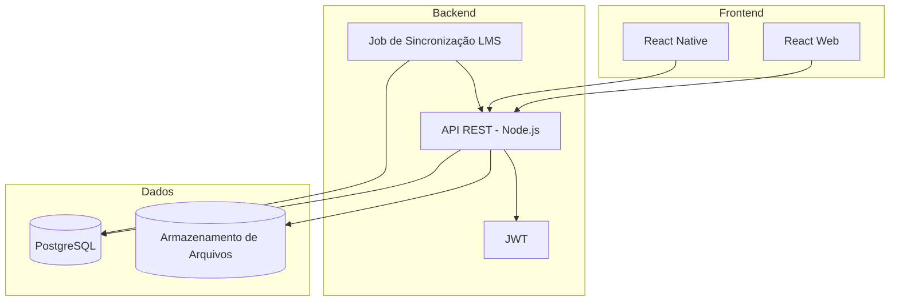

# Arquitetura do Sistema - EducationHub

## Visão rápida
Simples e direto: um frontend, uma API e o PostgreSQL. Uploads vão pro S3. Um job faz a sincronização com o LMS quando configurado.

## Módulos da API
- Autenticação e Conta: registro, login, recuperação de senha, perfil
- Conteúdo: documentos (CRUD), upload e compartilhamento simples
- Comunicação: mensagens diretas e fórum básico
- Feedback: envio e listagem de feedbacks
- Integração LMS: cadastro de integração e job de sincronização

## Notas de implementação
- Uma base de código só (sem microsserviços)
- JWT com expiração, hash de senha com bcrypt
- Upload pro S3 usando URLs assinadas
- Job de sync pode ser um cron (ex: a cada 15min) ou botão "Sincronizar agora"
- Logs simples no começo; depois dá pra evoluir

## Possivel Deploy
- API em uma EC2 pequena (ou Docker em VPS)
- PostgreSQL gerenciado (RDS) ou instância simples
- S3 para arquivos
- CloudFront opcional pra servir arquivos mais rápido

