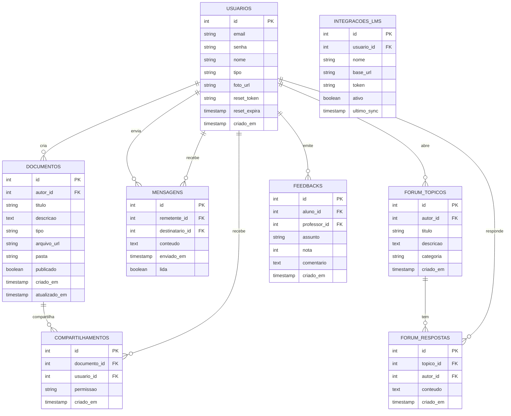

# Banco de Dados - EducationHub

## Diagrama das Tabelas

## Tabelas (direto ao ponto)

### usuarios
- id, email (único), senha (hash), nome, tipo ("professor" | "aluno"), foto_url
- reset_token/reset_expira para recuperação de senha

### documentos
- autor_id (quem subiu), título, descrição, tipo (pdf, video, ppt, etc), arquivo_url, pasta, publicado

### compartilhamentos
- documento_id, usuario_id, permissao ("viewer" | "editor")

### mensagens
- remetente_id, destinatario_id, conteudo, enviado_em, lida

### forum_topicos / forum_respostas
- tópicos e respostas simples com autor e timestamps

### feedbacks
- aluno_id, professor_id, assunto (matéria), nota (1–5), comentário

### integracoes_lms
- dados mínimos da integração e último sync

