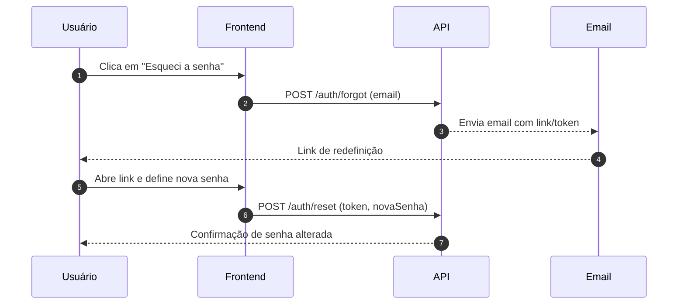

# Diagramas - EducationHub

## Recuperação de Senha (simples)



## Sincronização com LMS (manual)

```mermaid
flowchart LR
  A[Usuário clica em "Sincronizar agora"] --> B[API valida integração]
  B -->|ok| C[Busca dados no LMS]
  C --> D[Converte e valida]
  D --> E[Atualiza/insere no DB]
  E --> F[Retorna resumo da sync]
  B -->|erro| X[Mostra erro de configuração]
```

## Visão de Módulos (alto nível)

```mermaid
graph TB
  subgraph Frontend
    Login
    Documentos
    Mensagens
    Fórum
    Feedback
    LMSConfig
  end

  subgraph Backend(API)
    Auth[Auth/Conta]
    Docs[Conteúdo]
    Msgs[Mensagens]
    Forum[Fórum]
    Fbk[Feedback]
    LMS[LMS]
  end

  DB[(PostgreSQL)]
  S3[(Arquivos - S3)]

  Login --> Auth
  Documentos --> Docs
  Mensagens --> Msgs
  Fórum --> Forum
  Feedback --> Fbk
  LMSConfig --> LMS

  Docs --> DB
  Msgs --> DB
  Forum --> DB
  Fbk --> DB
  Auth --> DB
  Docs --> S3
```


